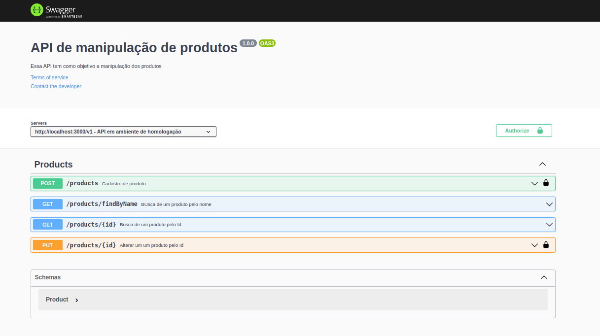

<h1 align="center">Swagger</h1>

<p align="center">
  

  
</p>

<p align="center">
  <a href="#-projeto">Projeto</a>&nbsp;&nbsp;&nbsp;|&nbsp;&nbsp;&nbsp;
  <a href="#-tecnologias">Tecnologias</a>&nbsp;&nbsp;&nbsp;|&nbsp;&nbsp;&nbsp;
  <a href="#-ambiente">Ambiente</a>&nbsp;&nbsp;&nbsp;|&nbsp;&nbsp;&nbsp;
  <a href="#-execução">Execução</a>&nbsp;&nbsp;&nbsp;|&nbsp;&nbsp;&nbsp;
  <a href="#-licença">Licença</a>&nbsp;&nbsp;&nbsp;|&nbsp;&nbsp;&nbsp;
  <a href="#-referências">Referências</a>
</p>

<p align="center">
  
</p>

## 🌱 Projeto

- Projeto utilizado para demonstração de uma documentação da `api` com o `swagger`.

## ✨ Tecnologias

- [Nodejs](https://nodejs.org/en/)
- [TypeScript](https://www.typescriptlang.org/)
- [Swagger](https://swagger.io/)

## 🛠️ Ambiente 

- Executando o container

```console
$ docker run --rm -it -v $(pwd)/:/usr/src/app -p 3000:3000 node:14 bash
```

- Acessando o diretório de trabalho

```console
$ cd /usr/src/app
```

- Criando o projeto com `yarn`

```console
$ yarn init -y
```

- Instalação da dependência e configuração do `typescript`

- Typescript

```console
$ yarn add typescript -D
```

- Inicializando o `typescript`

```console
$ yarn tsc --init
```

- Converter o `typescript` para `javascript`

```console
$ yarn tsc
```

- Instalando o `express`

```console
$ yarn add express
$ yarn add @types/express -D
```

- Instalar biblioteca `uuid`

```bash
$ yarn add uuid
$ yarn add @types/uuid -D
```

- Instalar o `swagger`

```bash
$ yarn add swagger-ui-express
$ yarn add @types/swagger-ui-express -D
```

- Automatizando o processo de conversão de typescript para javascript

- Instalação da biblioteca responsável pela conversão

```console
$ yarn add ts-node-dev -D
```

- Ajuste do `package.json`

```console
  "scripts" : {
    "dev" : "ts-node-dev src/server.ts"
  }
```

- Rodando o projeto

```bash
$ yarn dev
```

## 🚀 Execução

- Clone o repositório
- Instale as dependências: `yarn`
- Inicie o servidor: `yarn dev`

- URL: http://localhost:3000/api-docs

## 📄 Licença

Esse projeto está sob a licença MIT. Veja o arquivo [LICENSE](LICENSE.md) para mais detalhes.

## 🙇 Referências

- [Canal da Rocketseat](https://www.youtube.com/channel/UCSfwM5u0Kce6Cce8_S72olg)
